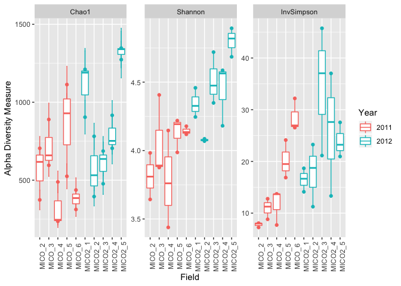
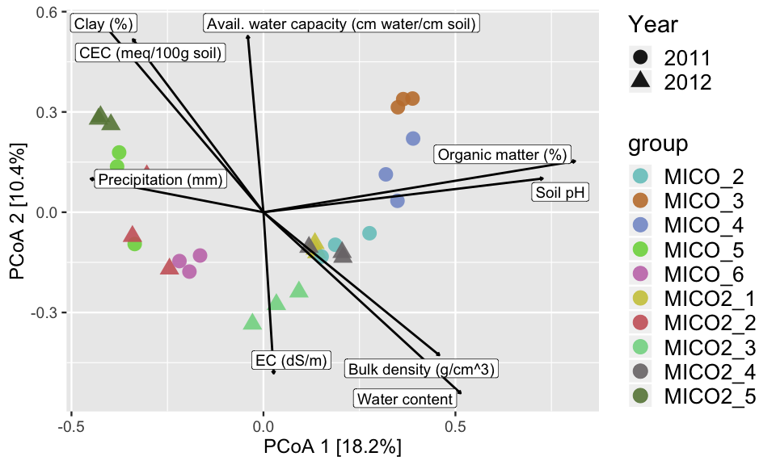

```
##     phyloseq      ggplot2 RColorBrewer         plyr        dplyr 
##         TRUE         TRUE         TRUE         TRUE         TRUE 
##        tidyr        knitr     magrittr          ape        vegan 
##         TRUE         TRUE         TRUE         TRUE         TRUE 
##       ggtree      cowplot      ggrepel       gtable    gridExtra 
##         TRUE         TRUE         TRUE         TRUE         TRUE 
##         biom       ampvis         here 
##         TRUE         TRUE         TRUE
```

## Importing amplicon data

Read the `biom` files to do the analysis of the data limiting to the fields sampled in Michigan in 2011 and 2012.


```r
#File reading
Corn_COI_file <- here("data","COI_soil_otu_table_open.biom")
CornCOI <- import_biom(Corn_COI_file)
```

```
## Warning in strsplit(msg, "\n"): input string 1 is invalid in this locale
```

```r
#Filtering samples to Corn fields
Corn_COI <- prune_samples((grepl('MICO', sample_names(CornCOI))), CornCOI)

#Rename tax ranks to actual names
colnames(tax_table(Corn_COI)) <- c("Phylum","Class","Order",
                                  "Family","Genus","Clade","Species","Kingdom")
```


## Alpha diversity for amplicon data


```r
#Plotting richness
alpha.corn <- plot_richness(Corn_COI, "group", 
              measures = c("InvSimpson","Shannon","Chao1"), color = "Year")

alpha.corn + geom_boxplot() + xlab("Field") + theme_gray() +
  theme(axis.text.x = element_text(angle = 90))
```

<!-- -->

## Community composition based on amplicon data


```r
#Summarizing by field
Oom_phylo <- tax_glom(Corn_COI, taxrank = "Clade")
Oom_phylo <- merge_samples(Oom_phylo, "group")

#Pruning the top 20 taxa
most_taxa <- sort(taxa_sums(Oom_phylo), TRUE)[1:15]
Oom_phylo_top20 <- prune_taxa(names(most_taxa), Oom_phylo)
ntaxa(Oom_phylo_top20)
```

```
## [1] 15
```

```r
#Transform counts for plot
#Oom_phylo_state <- transform_sample_counts(Oom_phylo_state, 
#                                           function(x) 100 * x/sum(x))
State_Year <- psmelt(Oom_phylo_top20)

#Color scale
pal <- colorRampPalette(brewer.pal(12, "Paired"))

#Reorder factor
Clade_factor <- State_Year %>% group_by(Clade) %>% dplyr::summarise(sum(Abundance))
Clade_factor <- Clade_factor[order(-Clade_factor$`sum(Abundance)`),]
Clade_factor <- Clade_factor$Clade
State_Year$Clade <- factor(State_Year$Clade, levels = Clade_factor)
levels(State_Year$Clade)
```

```
##  [1] "Pythium_Clade_F"      "Pythium_Clade_I"      "Pythium_Clade_D"     
##  [4] "Pythium_Clade_B"      "Pythium_Clade_J"      "Pythium_Clade_E"     
##  [7] "Pythium_sp_nov"       "Phytopythium"         "Phytophthora_Clade_8"
## [10] "Phytophthora_Clade_1" "Pythium_Clade_H"      "Pythium_Clade_A"     
## [13] "Saprolegnia"          "Achlya"               "Aphanomyces"
```

```r
data_state <- dplyr::select(State_Year, Sample, Abundance, Clade)
data_state <- data_state[with(data_state, order(Clade, as.numeric(Clade))),]

#Plot
(ByState <- ggplot(data = data_state, aes(Sample, Abundance, fill = Clade)) +
  geom_bar(stat = "identity", position = position_fill()) + coord_flip() +
  scale_fill_manual(values = pal(20)) + 
  theme_gray() + 
  theme(text = element_text(size = 15)))
```


## Culture data: isolation frequency

Initial analysis of culture data and plotting frequency of isolation per species


```r
#Importing otu like matrix, tax table and sample data for culture collection
culture_otu <- read.table(here("data","otu_corn_culture.txt")) %>% as.matrix()

culture_tax <- read.table(here("data","tax_corn_culture.txt")) %>% as.matrix() 

culture_data <- read.table(here("data","data_corn_culture.txt"), sep = "\t", header = TRUE, row.names = "group")

otu_corn_ct <- otu_table(culture_otu, taxa_are_rows = TRUE)
tax_corn_ct <- tax_table(culture_tax)
data_corn_ct <- sample_data(culture_data)

#Creating phyloseq object for culture collection
corn_ct <- phyloseq(otu_corn_ct, tax_corn_ct, data_corn_ct)

#Species recovery by isolation
corn_ct_sp <- psmelt(corn_ct)
corn_ct2 <- corn_ct_sp %>% group_by(Species, Year) %>% summarise(Abd = sum(Abundance))
corn_ct2$Year <- as.factor(corn_ct2$Year)

(ct_bar_plot <- ggplot(corn_ct2) + 
  geom_bar(aes(x = reorder(Species, Abd, mean), y = Abd, fill = Year), stat = "identity") + 
  labs(x ="Species", y = "Abundance") +
  coord_flip() +
  scale_fill_manual(values = c("#7fbf7b", "#3288bd")) +
  theme_gray() +
  theme(text = element_text(size = 15),
        axis.text.y = element_text(face = "italic")))
```


## Importing culture data and merging data with amplicon phyloseq object


```r
#merging amplicon dataset by field
Oom_group <- merge_samples(Corn_COI, "group")
Oom_group <- subset_taxa(Oom_group, Clade != "NA")

#adding info to phyloseq files
sample_data(corn_ct)$type <- "Culture"
sample_data(Oom_group)$type <- "COI amplicon"
sample_names(corn_ct) <- paste(sample_names(corn_ct),"_ct",sep = "")
sample_names(Oom_group) <- paste(sample_names(Oom_group),"_COI",sep = "")

#transform abundances
corn_ct2 <- transform_sample_counts(corn_ct, function(OTU) (OTU/sum(OTU)))
Oom_group2 <- transform_sample_counts(Oom_group, function(OTU) (OTU/sum(OTU)))

#merge and transform abundances
ct_COI_corn <- merge_phyloseq(Oom_group, corn_ct)
ct_COI_corn2 <- merge_phyloseq(Oom_group2, corn_ct2)
```

### Comparing culture data with amplicon data


```r
#Creating data frame with abundance data
ct_COI_corn.psmelt <- psmelt(ct_COI_corn)

ct_COI_corn_clade <- ct_COI_corn.psmelt %>% 
  group_by(Clade, type) %>% 
  summarise(abd = sum(Abundance)) %>%
  group_by(type) %>%
  mutate(total = sum(abd)) %>%
  mutate(Rel.abundance = (abd/total))


ct_COI_corn_clade <-  ct_COI_corn_clade %>%
  dplyr::select(Clade,type,Rel.abundance) %>% 
  spread(type, Rel.abundance) %>% 
  top_n(n =15, wt = `COI amplicon`) %>%
  gather(type, Rel.abundance, 2:3)

(clade.graph <- ggplot(ct_COI_corn_clade) + 
  geom_bar(aes(x = reorder(Clade, Rel.abundance, mean), y = Rel.abundance), stat = "identity") + 
  facet_grid(. ~ type, scales = "free_y") +
  ylab("Relative abundance") +
  xlab("Genus/Clade") +
  coord_flip() + 
  theme_gray(base_size = 16) + 
  theme(axis.text.x = element_text(angle = 45, vjust = 1, hjust = 1),
        axis.text.y = element_text(size = 18),
        strip.text = element_text(face = "bold", size = 20)))
```



```r
ct_COI_corn_genus <- psmelt(ct_COI_corn) %>% 
  group_by(Species, type) %>% 
  summarise(abd = sum(Abundance)) %>%
  group_by(type) %>%
  mutate(total = sum(abd)) %>%
  mutate(Rel.abundance = (abd/total))

ct_COI_corn_genus <-  ct_COI_corn_genus %>%
  dplyr::select(Species,type,Rel.abundance) %>% 
  spread(type, Rel.abundance) %>% 
  top_n(n=12, wt = `COI amplicon`) %>%
  gather(type, Rel.abundance, 2:3)

(species.graph <- ggplot(ct_COI_corn_genus) + 
  geom_bar(aes(x = reorder(Species, Rel.abundance, mean), 
               y = Rel.abundance), stat = "identity") + 
  facet_grid(. ~ type, scales = "free_y") +
  xlab("Top 12 Species") +
  ylab("Relative abundance") +
  coord_flip() + 
  theme_gray(base_size = 16) + 
  theme(axis.text.x = element_text(angle = 45, vjust = 1, hjust = 1),
        axis.text.y = element_text(size = 18),
        strip.text = element_text(face = "bold", size = 20)))
```


## Beta diversity

### Ordination analysis for culture and amplicon


```r
colors2 <- c("#77C7C6",
"#C37F3B",
"#869BCF",
"#7DD54E",
"#C67BB7",
"#CDC84A",
"#CC6569",
"#83D693",
"#7A7678",
"#698547",
"#D3C1A7",
"#6ca556")
sample_data(ct_COI_corn)$Year <- as.factor(sample_data(ct_COI_corn)$Year)

#Beta diversity culture and amplicon
Oom_biom_ord <- ordinate(ct_COI_corn, "PCoA", "bray")
ord_plot <- plot_ordination(ct_COI_corn, Oom_biom_ord, color = "Year", shape = "type")
(ord_plot.COI <- ord_plot + geom_point(size = 5, alpha = 0.7) + 
  scale_colour_manual(values = colors2) + labs(title = "coxI") + 
  theme_gray(base_size = 18) + labs(color = "Year", shape = "Type")) 
```

<!-- -->


## Beta diversity for amplicon data only


```r
#Extracting the top 100 taxa
most_taxa <- sort(taxa_sums(Corn_COI), TRUE)[1:100]
Corn_COI_top100 <- prune_taxa(names(most_taxa), Corn_COI)

#Ordination analysis
Oom_biom_ord2 <- ordinate(Corn_COI_top100, "PCoA", "bray")
ord_plot2 <- plot_ordination(Corn_COI_top100, Oom_biom_ord2, color = "group", shape = "Year")
(ord_plot.COI <- ord_plot2 + geom_point(size = 5, alpha = 0.7) + 
  scale_colour_manual(values = colors2) + labs(title = "PCoA COI") +
  theme_gray(base_size = 18) + labs(color = "group", shape = "Year") +
  theme(legend.text = element_text(size = 20),
        legend.key.size = unit(0.9, "cm")))
```

<!-- -->

### Environmental/Edaphic factor analysis


```r
## Environment fit analysis
bray.pcoa <- ordinate(Corn_COI_top100, method = "PCoA", "bray")
env <- sample_data(Corn_COI_top100)
env <- env[,c(1,6,7,8,10,11,15,16,17,18,69,73)]
env[,1:12] <- sapply(env[,1:12], as.numeric)
str(env)
```

```
## 'data.frame':	30 obs. of  12 variables:
## Formal class 'sample_data' [package "phyloseq"] with 4 slots
##   ..@ .Data    :List of 12
##   .. ..$ : num  0.153 0.18 0.153 0.283 0.283 ...
##   .. ..$ : num  13.7 8.7 13.7 99.4 99.4 ...
##   .. ..$ : num  25.5 26.8 25.5 20.6 20.6 ...
##   .. ..$ : num  1.57 1.61 1.57 1 1 ...
##   .. ..$ : num  0 0 0 0 0 0 0 0 0 0 ...
##   .. ..$ : num  0 0 0 0 0 0 0 0 0 0 ...
##   .. ..$ : num  0.625 0.54 0.625 42.623 42.623 ...
##   .. ..$ : num  1115 1151 1115 1085 1085 ...
##   .. ..$ : num  728 830 728 845 845 ...
##   .. ..$ : num  822 955 822 905 905 ...
##   .. ..$ : num  30 29.5 30 21.4 21.4 ...
##   .. ..$ : num  7.342 7 7.342 0.874 0.874 ...
##   ..@ names    : chr  "AWC" "CEC7" "Clay" "Db3rdbar" ...
##   ..@ row.names: chr  "MICO2.1.2012.R1.COI" "MICO.3.2011.R2.COI" "MICO2.1.2012.R3.COI" "MICO2.5.2012.R1.COI" ...
##   ..@ .S3Class : chr "data.frame"
```

```r
Oom_env <- envfit(bray.pcoa$vectors, env, permutations = 999, na.rm = TRUE)

fit_data <- as.data.frame(scores(Oom_env, display = "vectors")) %>%
  add_rownames(var = "Env.var") %>%
  bind_cols(data.frame(Oom_env$vectors$r, Oom_env$vectors$pvals)) %>%
  #rename(R2 = Oom_env.vectors.r, P.value = Oom_env.vectors.pvals) %>%
  arrange(Oom_env.vectors.pvals)
  
## Supplementary material version

kable(fit_data, digits = 3, caption = "Significance and correlation\
of vectors fitted into PCoA ordination of oomycete communities associated with\
Corn seedlings", format = "markdown")
```


|Env.var         | Axis.1| Axis.2| Oom_env.vectors.r| Oom_env.vectors.pvals|
|:---------------|------:|------:|-----------------:|---------------------:|
|Clay            |  0.702|  0.016|             0.494|                 0.001|
|WC3rdbar        |  0.814|  0.105|             0.673|                 0.001|
|pHwater         |  0.489| -0.488|             0.478|                 0.001|
|OrgMatter       | -0.386|  0.514|             0.413|                 0.003|
|Db3rdbar        |  0.437| -0.439|             0.383|                 0.006|
|AWC             | -0.014|  0.587|             0.344|                 0.007|
|CEC7            | -0.322|  0.464|             0.319|                 0.009|
|Precip_2011     | -0.431|  0.022|             0.186|                 0.064|
|EC              | -0.001| -0.409|             0.167|                 0.068|
|Precip_30yr_avg | -0.304| -0.252|             0.156|                 0.093|
|Precip_2012     |  0.073|  0.074|             0.011|                 0.865|
|ECEC            |  0.000|  0.000|             0.000|                 1.000|

### Results ordination and environmental data


```r
## Vectors for plot
fit_reduced <- fit_data[fit_data$Oom_env.vectors.pvals < 0.05,] 

fit_plot <- as.data.frame(scores(Oom_env, display = "vectors")) %>%
  add_rownames(var = "Env.var") %>%
  inner_join(fit_reduced, by = "Env.var") %>%
  arrange(Oom_env.vectors.pvals) 

fit_plot$Env.var2 <- c("Clay (%)","Organic matter (%)", "Water content",
                       "Soil pH","Bulk density (g/cm^3)",
                       "CEC (meq/100g soil)",
                       "Avail. water capacity (cm water/cm soil)")

ord_plot.data <- plot_ordination(Corn_COI_top100, Oom_biom_ord2, 
                            color = "group", shape = "Year", justDF = TRUE)

(ord.plot.env <- ggplot(data = ord_plot.data, aes(x = Axis.1, y = Axis.2)) + 
  geom_point(aes(color=group, shape=Year), size = 6, alpha = 0.9) + 
  #scale_color_brewer(type = "div", palette ="Spectral") +
  labs(color = "group", shape = "Year", x = "PCoA 1 [18.2%]", y = "PCoA 2 [10.4%]") +
  scale_colour_manual(values = colors2) +
  geom_segment(data = fit_plot, aes(x = 0, xend = Axis.1.x, y = 0, yend = Axis.2.x), 
               arrow = arrow(length = unit(0.1,"cm")), color = "black", size = 1) + 
  geom_label_repel(data = fit_plot, aes(x = Axis.1.x, y = Axis.2.x, label = Env.var2), 
            size = 5, force = 1) + #facet_wrap(~Year) +
  theme_gray(base_size = 18) + theme(legend.title = element_text(size = 22),
                                     legend.text = element_text(size = 20),
                                     legend.key.size = unit(0.8, "cm")))
```




## Relative abundance of top 20 species


```r
Corn_COI.f <- subset_taxa(Corn_COI, !is.na(Clade)) 
amp_heatmap(data = Corn_COI.f,
            group = "group",
            tax.show = 20,
            tax.aggregate = "Species",
            tax.add = "Clade")
```


