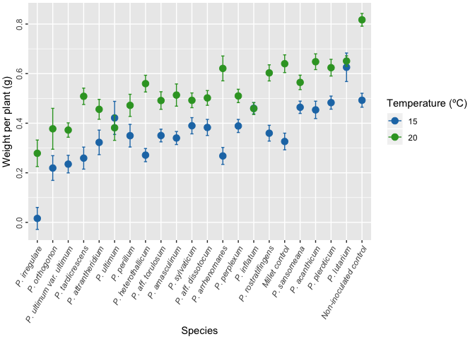
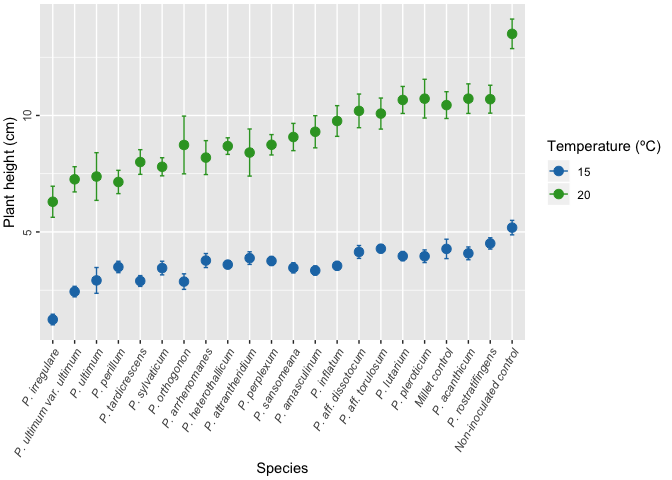
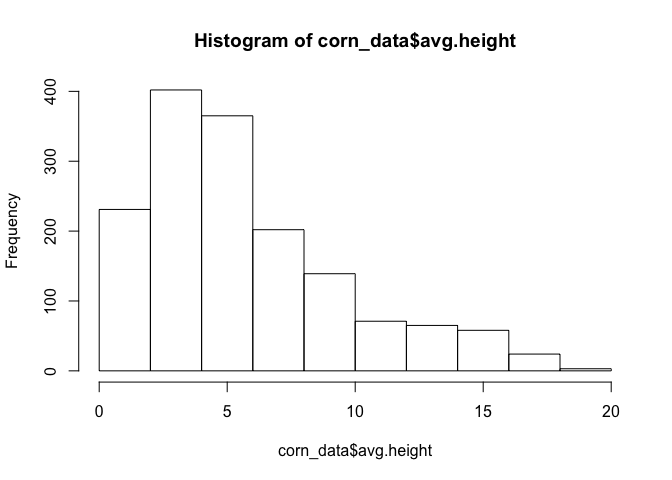
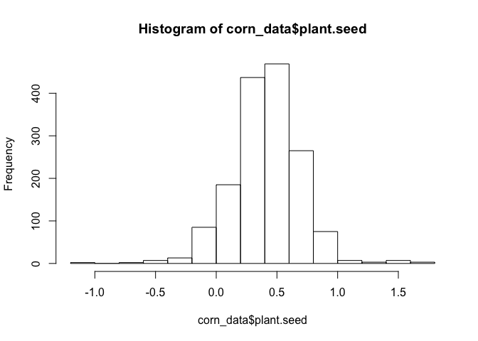
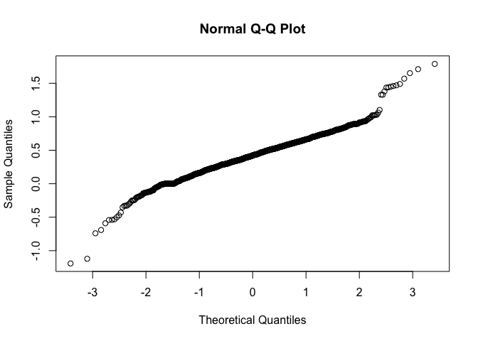
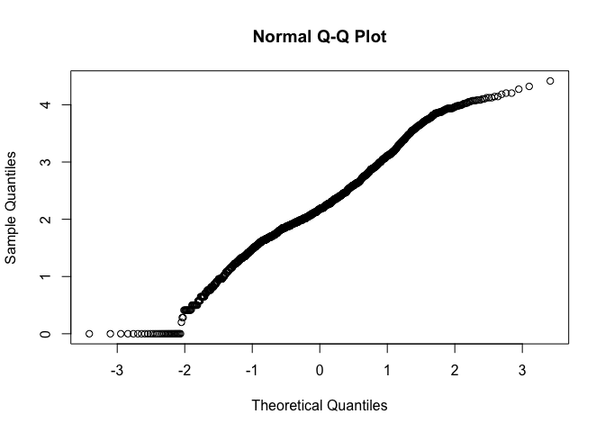
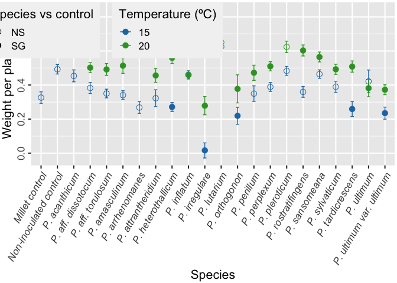
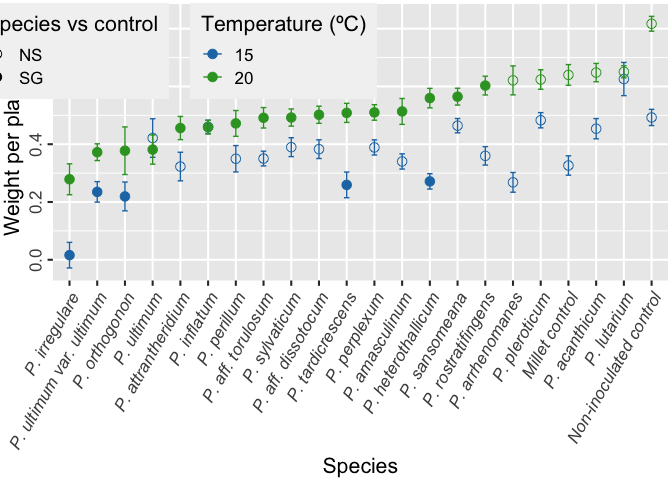
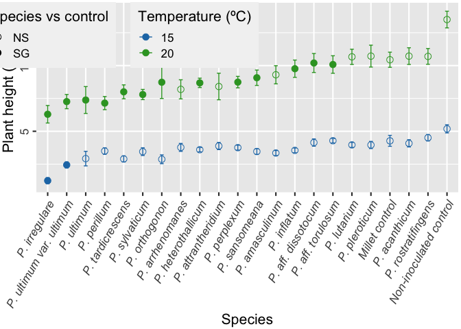
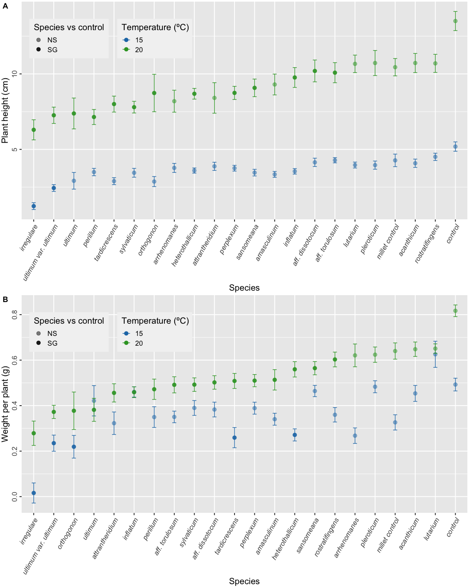

```
##      ggplot2 RColorBrewer         grid    gridExtra         plyr 
##         TRUE         TRUE         TRUE         TRUE         TRUE 
##         lme4      lsmeans        knitr        tidyr        dplyr 
##         TRUE         TRUE         TRUE         TRUE         TRUE 
##         MASS     magrittr     reshape2   FactoMineR      cowplot 
##         TRUE         TRUE         TRUE         TRUE         TRUE 
##      stringr         here      cowplot 
##         TRUE         TRUE         TRUE
```

Reading raw data and summarizing data by measurement:


```r
#Reading the file
corn_data <- read.csv(file = here("data","Corn_clean_data"), sep = "\t")
corn_data$species <- trim(corn_data$species)
corn_data$temp <- factor(corn_data$temp)
corn_data <-  corn_data %>% filter(species != "P. litorale")


#Summarizing data using different parameters by plyr library
corn_sum <- ddply(corn_data, c("species","temp"), summarise,
              N = length(plant.seed),
              mean_wp = mean(plant.seed), 
              sd_wp = sd(plant.seed),
              se_wp = sd_wp/sqrt(N),
              mean_ph = mean(avg.height), 
              sd_ph = sd(avg.height),
              se_ph = sd_ph/sqrt(N)
              )
  
#Setting limits for error bars
wp_limits <- aes(ymax = mean_wp + se_wp, ymin=mean_wp - se_wp)
ph_limits <- aes(ymax = mean_ph + se_ph, ymin=mean_ph - se_ph)
```

Initial plot of the wieght per plant:


```r
(plot_wp <- ggplot(corn_sum, 
                   aes(x = reorder(species, mean_wp, median), 
                       y = mean_wp, 
                       colour = as.factor(temp))) +
  geom_point(stat = "identity", size = 3) +
  geom_errorbar(wp_limits, width=0.2) + 
  scale_color_manual(values = c("#1f78b4", "#33a02c")) + theme_gray() +
  theme(axis.text.x=element_text(angle=60, hjust = 1, vjust = 1, face="italic"), 
        axis.text.y=element_text(angle=90, hjust = 0.5), 
        plot.margin=unit(c(1,1,1,1), "mm")) +
  labs(x="Species", y = "Weight per plant (g)", colour = "Temperature (ºC)"))
```

<!-- -->


Initial plot of plant height:


```r
(plot_ph <- ggplot(corn_sum, 
                   aes(x = reorder(species, mean_ph, mean), 
                       y = mean_ph, 
                       colour = as.factor(temp))) +
  geom_point(stat = "identity", size = 3) +
  geom_errorbar(ph_limits, width=0.2) + 
  scale_color_manual(values = c("#1f78b4", "#33a02c")) + 
   theme_gray() +
  theme(axis.text.x=element_text(angle=60, hjust = 1, vjust = 1, face="italic"), 
        axis.text.y=element_text(angle=90, hjust = 0.5), 
        plot.margin=unit(c(1,1,1,1), "mm")) +
  labs(x="Species", y = "Plant height (cm)", colour = "Temperature (ºC)"))
```

<!-- -->


Checking the normality of the data:


```r
hist(corn_data$avg.height)
```

<!-- -->

```r
hist(corn_data$plant.seed)
```

<!-- -->

```r
corn_data$Ht <- sqrt(corn_data$avg.height)

qqnorm(corn_data$plant.seed)
```

<!-- -->

```r
qqnorm(corn_data$Ht)
```

<!-- -->

#Plant height 15C


```r
set_15 <- subset(corn_data, corn_data$temp=="15")
fit.ht <- nlme::lme(Ht ~ species, random = ~1|isolate, method="ML", data=set_15)
fit1.ht <- nlme::lme(Ht ~ species, random = ~1|set/isolate, method="ML", data=set_15)
fit2.ht <- nlme::lme(Ht ~ species, random = ~1|set, method="ML", data=set_15)
anova(fit.ht, fit1.ht, fit2.ht)
```

```
##         Model df      AIC      BIC    logLik   Test   L.Ratio p-value
## fit.ht      1 24 1214.638 1330.939 -583.3189                         
## fit1.ht     2 25 1213.162 1334.310 -581.5813 1 vs 2   3.47536  0.0623
## fit2.ht     3 24 1458.978 1575.279 -705.4889 2 vs 3 247.81532  <.0001
```

```r
anova(fit1.ht)
```

```
##             numDF denDF  F-value p-value
## (Intercept)     1   877 475.3891  <.0001
## species        21    40   3.2886   6e-04
```

```r
fit.ht.ls <- lsmeans(fit1.ht, "species")
(fit.ht.ctrl <- contrast(fit.ht.ls, "trt.vs.ctrl", ref=2))
```

```
##  contrast                                         estimate    SE df
##  Millet control - Non-inoculated control            -0.248 0.322 40
##  P. acanthicum - Non-inoculated control             -0.313 0.294 40
##  P. aff. dissotocum - Non-inoculated control        -0.294 0.294 40
##  P. aff. torulosum - Non-inoculated control         -0.243 0.280 40
##  P. amasculinum - Non-inoculated control            -0.365 0.325 40
##  P. arrhenomanes - Non-inoculated control           -0.242 0.396 40
##  P. attrantheridium - Non-inoculated control        -0.207 0.396 40
##  P. heterothallicum - Non-inoculated control        -0.288 0.297 40
##  P. inflatum - Non-inoculated control               -0.485 0.282 40
##  P. irregulare - Non-inoculated control             -1.487 0.280 40
##  P. lutarium - Non-inoculated control               -0.290 0.279 40
##  P. orthogonon - Non-inoculated control             -0.825 0.297 40
##  P. perillum - Non-inoculated control               -0.327 0.325 40
##  P. perplexum - Non-inoculated control              -0.255 0.297 40
##  P. pleroticum - Non-inoculated control             -0.294 0.322 40
##  P. rostratifingens - Non-inoculated control        -0.190 0.294 40
##  P. sansomeana - Non-inoculated control             -0.398 0.294 40
##  P. sylvaticum - Non-inoculated control             -0.370 0.297 40
##  P. tardicrescens - Non-inoculated control          -0.641 0.279 40
##  P. ultimum - Non-inoculated control                -0.844 0.322 40
##  P. ultimum var. ultimum - Non-inoculated control   -0.855 0.269 40
##  t.ratio p.value
##  -0.772  0.9871 
##  -1.064  0.9379 
##  -1.000  0.9533 
##  -0.868  0.9765 
##  -1.124  0.9207 
##  -0.610  0.9963 
##  -0.522  0.9984 
##  -0.969  0.9598 
##  -1.722  0.6187 
##  -5.320  0.0001 
##  -1.038  0.9445 
##  -2.778  0.1081 
##  -1.007  0.9519 
##  -0.858  0.9778 
##  -0.913  0.9699 
##  -0.644  0.9950 
##  -1.354  0.8297 
##  -1.246  0.8774 
##  -2.298  0.2779 
##  -2.622  0.1504 
##  -3.174  0.0429 
## 
## P value adjustment: dunnettx method for 21 tests
```

```r
ht.15 <- data.frame(summary(fit.ht.ctrl)) %>% 
              separate(contrast, c('species','contrast'), sep = " - ", remove = TRUE)
ht.15$ht.sg <- ifelse(ht.15$p.value<0.05,"SG","NS")
```

#Plant weight 15C


```r
set_15 <- subset(corn_data, corn_data$temp=="15")
fit <- nlme::lme(plant.seed ~ species, random = ~1|isolate, method="ML", data=set_15)
fit1 <- nlme::lme(plant.seed ~ species, random = ~1|trial/isolate, method="ML", data=set_15)
fit2 <- nlme::lme(plant.seed ~ species, random = ~1|set, method="ML", data=set_15)
anova(fit, fit1, fit2)
```

```
##      Model df       AIC        BIC   logLik   Test  L.Ratio p-value
## fit      1 24 -180.4110  -64.10986 114.2055                        
## fit1     2 25 -242.3353 -121.18826 146.1676 1 vs 2  63.9243  <.0001
## fit2     3 24  155.9854  272.28652 -53.9927 2 vs 3 400.3207  <.0001
```

```r
anova(fit2)
```

```
##             numDF denDF   F-value p-value
## (Intercept)     1   917 1725.7359  <.0001
## species        21   917   11.9142  <.0001
```

```r
fit.ls <- lsmeans(fit2, "species")
(fit.ctrl <- contrast(fit.ls, "trt.vs.ctrl", ref=2))
```

```
##  contrast                                         estimate     SE  df
##  Millet control - Non-inoculated control          -0.16633 0.0670 917
##  P. acanthicum - Non-inoculated control           -0.03889 0.0611 917
##  P. aff. dissotocum - Non-inoculated control      -0.10978 0.0611 917
##  P. aff. torulosum - Non-inoculated control       -0.14233 0.0580 917
##  P. amasculinum - Non-inoculated control          -0.15233 0.0670 917
##  P. arrhenomanes - Non-inoculated control         -0.22467 0.0820 917
##  P. attrantheridium - Non-inoculated control      -0.17000 0.0820 917
##  P. heterothallicum - Non-inoculated control      -0.22133 0.0611 917
##  P. inflatum - Non-inoculated control             -0.03233 0.0580 917
##  P. irregulare - Non-inoculated control           -0.47670 0.0580 917
##  P. lutarium - Non-inoculated control              0.13297 0.0589 917
##  P. orthogonon - Non-inoculated control           -0.27342 0.0611 917
##  P. perillum - Non-inoculated control             -0.14300 0.0670 917
##  P. perplexum - Non-inoculated control            -0.10378 0.0611 917
##  P. pleroticum - Non-inoculated control           -0.00967 0.0670 917
##  P. rostratifingens - Non-inoculated control      -0.13289 0.0611 917
##  P. sansomeana - Non-inoculated control           -0.02844 0.0611 917
##  P. sylvaticum - Non-inoculated control           -0.10287 0.0611 917
##  P. tardicrescens - Non-inoculated control        -0.23343 0.0580 917
##  P. ultimum - Non-inoculated control              -0.07127 0.0670 917
##  P. ultimum var. ultimum - Non-inoculated control -0.25768 0.0560 917
##  t.ratio p.value
##  -2.484  0.1699 
##  -0.636  0.9958 
##  -1.796  0.5628 
##  -2.455  0.1814 
##  -2.275  0.2635 
##  -2.740  0.0914 
##  -2.073  0.3788 
##  -3.621  0.0058 
##  -0.558  0.9980 
##  -8.221  <.0001 
##   2.259  0.2718 
##  -4.473  0.0002 
##  -2.136  0.3407 
##  -1.698  0.6293 
##  -0.144  1.0000 
##  -2.174  0.3184 
##  -0.465  0.9993 
##  -1.683  0.6393 
##  -4.026  0.0012 
##  -1.064  0.9412 
##  -4.600  0.0001 
## 
## P value adjustment: dunnettx method for 21 tests
```

```r
wp.15 <- data.frame(summary(fit.ctrl)) %>% 
              separate(contrast, c('species','contrast'), sep = " - ", remove = TRUE)
wp.15$wp.sg <- ifelse(wp.15$p.value<0.05,"SG","NS")
```

#Plant height 20C


```r
set_20 <- subset(corn_data, corn_data$temp=="20")
fit.ht.20 <- nlme::lme(Ht ~ species, random = ~1|isolate, method="ML", data=set_20)
fit1.ht.20 <- nlme::lme(Ht ~ species, random = ~1|set/isolate, method="ML", data=set_20)
fit2.ht.20 <- nlme::lme(Ht ~ species, random = ~1|set, method="ML", data=set_20)
anova(fit.ht.20, fit1.ht.20, fit2.ht.20)
```

```
##            Model df      AIC      BIC    logLik   Test  L.Ratio p-value
## fit.ht.20      1 24 1114.228 1220.541 -533.1138                        
## fit1.ht.20     2 25 1105.389 1216.132 -527.6944 1 vs 2 10.83895   0.001
## fit2.ht.20     3 24 1134.998 1241.311 -543.4989 2 vs 3 31.60902  <.0001
```

```r
anova(fit2.ht.20)
```

```
##             numDF denDF  F-value p-value
## (Intercept)     1   597 353.3978  <.0001
## species        21   597   7.4696  <.0001
```

```r
fit.ht.ls <- lsmeans(fit2.ht.20, "species")
(fit.ht.ctrl <- contrast(fit.ht.ls, "trt.vs.ctrl", ref=2))
```

```
##  contrast                                         estimate    SE  df
##  Millet control - Non-inoculated control            -0.447 0.186 597
##  P. acanthicum - Non-inoculated control             -0.496 0.170 597
##  P. aff. dissotocum - Non-inoculated control        -0.590 0.170 597
##  P. aff. torulosum - Non-inoculated control         -0.679 0.162 597
##  P. amasculinum - Non-inoculated control            -0.433 0.188 597
##  P. arrhenomanes - Non-inoculated control           -0.607 0.230 597
##  P. attrantheridium - Non-inoculated control        -0.582 0.230 597
##  P. heterothallicum - Non-inoculated control        -0.515 0.172 597
##  P. inflatum - Non-inoculated control               -0.823 0.164 597
##  P. irregulare - Non-inoculated control             -1.401 0.162 597
##  P. lutarium - Non-inoculated control               -0.438 0.161 597
##  P. orthogonon - Non-inoculated control             -1.091 0.188 597
##  P. perillum - Non-inoculated control               -0.799 0.188 597
##  P. perplexum - Non-inoculated control              -0.513 0.172 597
##  P. pleroticum - Non-inoculated control             -0.429 0.186 597
##  P. rostratifingens - Non-inoculated control        -0.496 0.170 597
##  P. sansomeana - Non-inoculated control             -0.619 0.170 597
##  P. sylvaticum - Non-inoculated control             -0.678 0.172 597
##  P. tardicrescens - Non-inoculated control          -0.888 0.161 597
##  P. ultimum - Non-inoculated control                -1.058 0.186 597
##  P. ultimum var. ultimum - Non-inoculated control   -1.092 0.156 597
##  t.ratio p.value
##  -2.401  0.2045 
##  -2.913  0.0576 
##  -3.467  0.0102 
##  -4.198  0.0006 
##  -2.297  0.2532 
##  -2.640  0.1184 
##  -2.533  0.1526 
##  -2.986  0.0468 
##  -5.021  <.0001 
##  -8.657  <.0001 
##  -2.718  0.0974 
##  -5.791  <.0001 
##  -4.239  0.0005 
##  -2.977  0.0481 
##  -2.304  0.2496 
##  -2.914  0.0576 
##  -3.635  0.0056 
##  -3.931  0.0018 
##  -5.508  <.0001 
##  -5.689  <.0001 
##  -7.008  <.0001 
## 
## P value adjustment: dunnettx method for 21 tests
```

```r
ht.20 <- data.frame(summary(fit.ht.ctrl)) %>% 
              separate(contrast, c('species','contrast'), sep = " - ", remove = TRUE)
ht.20$ht.sg <- ifelse(ht.20$p.value<0.05,"SG","NS")
```

#Plant weight 20C


```r
fit.20 <- nlme::lme(plant.seed ~ species, random = ~1|isolate, method="ML", data=set_20)
fit1.20 <- nlme::lme(plant.seed ~ species, random = ~1|trial/isolate, method="ML", data=set_20)
fit2.20 <- nlme::lme(plant.seed ~ species, random = ~1|set, method="ML", data=set_20)
anova(fit.20, fit1.20, fit2.20)
```

```
##         Model df       AIC       BIC   logLik   Test  L.Ratio p-value
## fit.20      1 24 -250.2763 -143.9630 149.1381                        
## fit1.20     2 25 -264.0266 -153.2836 157.0133 1 vs 2 15.75034   1e-04
## fit2.20     3 24 -207.7103 -101.3970 127.8551 2 vs 3 58.31635  <.0001
```

```r
anova(fit2.20)
```

```
##             numDF denDF  F-value p-value
## (Intercept)     1   597 4054.055  <.0001
## species        21   597    9.888  <.0001
```

```r
fit.ls <- lsmeans(fit2.20, "species")
(fit.ctrl <- contrast(fit.ls, "trt.vs.ctrl", ref=2, adjust ="bon"))
```

```
##  contrast                                         estimate     SE  df
##  Millet control - Non-inoculated control            -0.177 0.0634 597
##  P. acanthicum - Non-inoculated control             -0.169 0.0579 597
##  P. aff. dissotocum - Non-inoculated control        -0.315 0.0579 597
##  P. aff. torulosum - Non-inoculated control         -0.326 0.0549 597
##  P. amasculinum - Non-inoculated control            -0.303 0.0634 597
##  P. arrhenomanes - Non-inoculated control           -0.196 0.0776 597
##  P. attrantheridium - Non-inoculated control        -0.361 0.0776 597
##  P. heterothallicum - Non-inoculated control        -0.257 0.0579 597
##  P. inflatum - Non-inoculated control               -0.358 0.0549 597
##  P. irregulare - Non-inoculated control             -0.538 0.0549 597
##  P. lutarium - Non-inoculated control               -0.166 0.0549 597
##  P. orthogonon - Non-inoculated control             -0.440 0.0634 597
##  P. perillum - Non-inoculated control               -0.345 0.0634 597
##  P. perplexum - Non-inoculated control              -0.307 0.0579 597
##  P. pleroticum - Non-inoculated control             -0.193 0.0634 597
##  P. rostratifingens - Non-inoculated control        -0.214 0.0579 597
##  P. sansomeana - Non-inoculated control             -0.252 0.0579 597
##  P. sylvaticum - Non-inoculated control             -0.325 0.0579 597
##  P. tardicrescens - Non-inoculated control          -0.308 0.0549 597
##  P. ultimum - Non-inoculated control                -0.435 0.0634 597
##  P. ultimum var. ultimum - Non-inoculated control   -0.445 0.0530 597
##  t.ratio p.value
##  -2.792  0.1135 
##  -2.920  0.0762 
##  -5.443  <.0001 
##  -5.929  <.0001 
##  -4.788  <.0001 
##  -2.524  0.2488 
##  -4.650  0.0001 
##  -4.447  0.0002 
##  -6.521  <.0001 
##  -9.806  <.0001 
##  -3.028  0.0539 
##  -6.933  <.0001 
##  -5.442  <.0001 
##  -5.305  <.0001 
##  -3.044  0.0511 
##  -3.698  0.0050 
##  -4.360  0.0003 
##  -5.610  <.0001 
##  -5.619  <.0001 
##  -6.870  <.0001 
##  -8.382  <.0001 
## 
## P value adjustment: bonferroni method for 21 tests
```

```r
wp.20 <- data.frame(summary(fit.ctrl)) %>% 
              separate(contrast, c('species','contrast'), sep = " - ", remove = TRUE)
wp.20$wp.sg <- ifelse(wp.20$p.value<0.05,"SG","NS")
```

Combining data into a single dataset after analysis of variance:


```r
ht.15$temp <- 15
wp.15$temp <- 15
ht.20$temp <- 20
wp.20$temp <- 20

ht <- bind_rows(ht.15, ht.20) %>% dplyr::select(species,temp,ht.sg)
ht$temp <- as.factor(ht$temp)
wp <- bind_rows(wp.15, wp.20) %>% dplyr::select(species,temp, wp.sg)
wp$temp <- as.factor(wp$temp)

corn_final <- full_join(corn_sum, ht, c("species","temp"))
corn_final <- full_join(corn_final, wp, c("species","temp"))

corn_final[is.na(corn_final)] <- "NS"
corn_final
```

```
##                    species temp  N    mean_wp     sd_wp      se_wp
## 1           Millet control   15 30 0.32633333 0.1836175 0.03352382
## 2           Millet control   20 20 0.64000000 0.1596509 0.03569903
## 3   Non-inoculated control   15 30 0.49266667 0.1535934 0.02804218
## 4   Non-inoculated control   20 20 0.81700000 0.1146390 0.02563406
## 5            P. acanthicum   15 45 0.45377778 0.2351623 0.03505593
## 6            P. acanthicum   20 30 0.64800000 0.1738321 0.03173725
## 7       P. aff. dissotocum   15 45 0.38288889 0.2174064 0.03240904
## 8       P. aff. dissotocum   20 30 0.50200000 0.1626982 0.02970448
## 9        P. aff. torulosum   15 60 0.35033333 0.1978612 0.02554377
## 10       P. aff. torulosum   20 40 0.49150000 0.2238784 0.03539828
## 11          P. amasculinum   15 30 0.34033333 0.1439991 0.02629052
## 12          P. amasculinum   20 20 0.51350000 0.2003845 0.04480734
## 13         P. arrhenomanes   15 15 0.26800000 0.1321795 0.03412861
## 14         P. arrhenomanes   20 10 0.62100000 0.1585209 0.05012872
## 15      P. attrantheridium   15 15 0.32266667 0.1917762 0.04951639
## 16      P. attrantheridium   20 10 0.45600000 0.1270346 0.04017185
## 17      P. heterothallicum   15 45 0.27133333 0.1783969 0.02659384
## 18      P. heterothallicum   20 30 0.55966667 0.1845541 0.03369482
## 19             P. inflatum   15 60 0.46033333 0.1770298 0.02285445
## 20             P. inflatum   20 40 0.45900000 0.1506635 0.02382199
## 21           P. irregulare   15 60 0.01596667 0.3428496 0.04426169
## 22           P. irregulare   20 40 0.27865000 0.3381409 0.05346477
## 23             P. lutarium   15 55 0.62563636 0.4264034 0.05749622
## 24             P. lutarium   20 40 0.65075000 0.1319127 0.02085723
## 25           P. orthogonon   15 45 0.21924444 0.3345595 0.04987318
## 26           P. orthogonon   20 20 0.37750000 0.3685344 0.08240681
## 27             P. perillum   15 30 0.34966667 0.2498701 0.04561983
## 28             P. perillum   20 20 0.47200000 0.1998249 0.04468221
## 29            P. perplexum   15 45 0.38888889 0.1764166 0.02629864
## 30            P. perplexum   20 30 0.51000000 0.1473443 0.02690127
## 31           P. pleroticum   15 30 0.48300000 0.1445361 0.02638856
## 32           P. pleroticum   20 20 0.62400000 0.1506058 0.03367648
## 33      P. rostratifingens   15 45 0.35977778 0.2138594 0.03188028
## 34      P. rostratifingens   20 30 0.60300000 0.1778676 0.03247404
## 35           P. sansomeana   15 45 0.46422222 0.1663961 0.02480487
## 36           P. sansomeana   20 30 0.56466667 0.1596134 0.02914129
## 37           P. sylvaticum   15 45 0.38980000 0.2192860 0.03268923
## 38           P. sylvaticum   20 30 0.49233333 0.1629625 0.02975275
## 39        P. tardicrescens   15 60 0.25923333 0.3441159 0.04442517
## 40        P. tardicrescens   20 40 0.50850000 0.2088614 0.03302388
## 41              P. ultimum   15 30 0.42140000 0.3657861 0.06678310
## 42              P. ultimum   20 20 0.38150000 0.2260560 0.05054766
## 43 P. ultimum var. ultimum   15 75 0.23498667 0.3067846 0.03542444
## 44 P. ultimum var. ultimum   20 50 0.37240000 0.2048475 0.02896981
##      mean_ph    sd_ph     se_ph ht.sg wp.sg
## 1   4.272000 2.280090 0.4162855    NS    NS
## 2  10.445500 2.571151 0.5749268    NS    NS
## 3   5.186000 1.702081 0.3107561    NS    NS
## 4  13.504500 2.836314 0.6342192    NS    NS
## 5   4.081333 1.842081 0.2746012    NS    NS
## 6  10.722333 3.476357 0.6346931    NS    NS
## 7   4.140889 1.853335 0.2762788    NS    NS
## 8  10.197667 3.956340 0.7223255    SG    SG
## 9   4.281333 1.346519 0.1738349    NS    NS
## 10 10.081750 4.215524 0.6665328    SG    SG
## 11  3.344333 1.076507 0.1965423    NS    NS
## 12  9.300500 3.086873 0.6902458    NS    SG
## 13  3.772667 1.166230 0.3011193    NS    NS
## 14  8.192000 2.300806 0.7275786    NS    NS
## 15  3.877333 1.049942 0.2710938    NS    NS
## 16  8.409000 3.196976 1.0109725    NS    SG
## 17  3.598444 1.141731 0.1701992    NS    SG
## 18  8.685333 1.951123 0.3562247    SG    SG
## 19  3.545667 1.416573 0.1828788    NS    NS
## 20  9.762750 4.166901 0.6588449    SG    SG
## 21  1.240667 1.758816 0.2270622    SG    SG
## 22  6.296000 4.218188 0.6669540    SG    SG
## 23  3.962545 1.458801 0.1967047    NS    NS
## 24 10.666250 3.667107 0.5798205    NS    NS
## 25  2.868667 2.236757 0.3334360    NS    SG
## 26  8.733500 5.543239 1.2395059    SG    SG
## 27  3.496667 1.341701 0.2449599    NS    NS
## 28  7.145000 2.235250 0.4998171    SG    SG
## 29  3.753778 1.280366 0.1908657    NS    NS
## 30  8.742333 2.394490 0.4371721    SG    SG
## 31  3.957000 1.488357 0.2717357    NS    NS
## 32 10.721500 3.720822 0.8320012    NS    NS
## 33  4.507111 1.626239 0.2424254    NS    NS
## 34 10.699000 3.280959 0.5990184    NS    SG
## 35  3.459778 1.473446 0.2196484    NS    NS
## 36  9.075333 3.203792 0.5849297    SG    SG
## 37  3.449778 1.963142 0.2926479    NS    NS
## 38  7.797333 2.128051 0.3885271    SG    SG
## 39  2.894333 1.794759 0.2317024    NS    SG
## 40  8.002250 3.348569 0.5294553    SG    SG
## 41  2.919667 3.031610 0.5534937    NS    NS
## 42  7.379000 4.578454 1.0237734    SG    SG
## 43  2.439867 1.952790 0.2254888    SG    SG
## 44  7.259800 3.827308 0.5412631    SG    SG
```

Plot of weight per plant indicating significance, samples were sorted based mean weight at 20C:


```r
(plot_wp1 <- ggplot(corn_final, 
                   aes(x = species, #reorder(species, mean_wp, mean), 
                       y = mean_wp, 
                       colour = as.factor(temp))) +
  geom_point(aes(shape=wp.sg), stat = "identity", size = 3) +
  geom_errorbar(wp_limits, width=0.2) + 
  scale_color_manual(values = c("#1f78b4", "#33a02c")) + 
  scale_shape_manual(values=c(21,19)) + theme_gray(base_size = 16) +
  theme(axis.text.x=element_text(angle=60, hjust = 1, vjust = 1, face="italic"), 
        axis.text.y=element_text(angle=90, hjust = 0.5), 
        plot.margin=unit(c(1,1,1,1), "mm"),
        legend.position = c(0.2 , 0.83),
        legend.box = "horizontal",
        legend.background = element_rect(fill="gray95"),
        legend.key = element_blank()) +
  labs(x="Species", y = "Weight per plant (g)", colour = "Temperature (ºC)",
       shape= "Species vs control"))
```

<!-- -->

```r
spp <- corn_sum %>% filter(temp == 20) %>% 
                    arrange(mean_wp) %>% 
                    dplyr::select(species)
(spp <- spp$species)
```

```
##  [1] "P. irregulare"           "P. ultimum var. ultimum"
##  [3] "P. orthogonon"           "P. ultimum"             
##  [5] "P. attrantheridium"      "P. inflatum"            
##  [7] "P. perillum"             "P. aff. torulosum"      
##  [9] "P. sylvaticum"           "P. aff. dissotocum"     
## [11] "P. tardicrescens"        "P. perplexum"           
## [13] "P. amasculinum"          "P. heterothallicum"     
## [15] "P. sansomeana"           "P. rostratifingens"     
## [17] "P. arrhenomanes"         "P. pleroticum"          
## [19] "Millet control"          "P. acanthicum"          
## [21] "P. lutarium"             "Non-inoculated control"
```

```r
plot_wp1$data$species <- factor(plot_wp1$data$species, levels = spp)
plot_wp1
```

<!-- -->

Plot for plant height including significance, in this case samples were sorted by overall plant height:


```r
(plot_ph1 <- ggplot(corn_final, 
                   aes(x = reorder(species, mean_ph, mean), 
                       y = mean_ph, 
                       colour = as.factor(temp))) +
  geom_point(aes(shape=ht.sg), stat = "identity", size = 3) +
  geom_errorbar(ph_limits, width=0.2) + 
  scale_color_manual(values = c("#1f78b4", "#33a02c")) + 
  scale_shape_manual(values=c(21,19), ) + theme_gray(base_size = 16) +
  theme(axis.text.x=element_text(angle=60, hjust = 1, vjust = 1, face="italic"), 
        axis.text.y=element_text(angle=90, hjust = 0.5), 
        plot.margin=unit(c(1,1,1,1), "mm"),
        legend.position = c(0.2 , 0.83),
        legend.box = "horizontal",
        legend.background = element_rect(fill="gray95"),
        legend.key = element_blank()) +
  labs(x="Species", y = "Plant height (cm)", 
       colour = "Temperature (ºC)", 
       shape= "Species vs control"))
```

<!-- -->

Using `cowplot` to arrange the final figure:


```r
plot_grid(plot_ph1, plot_wp1, labels = c("A","B"), nrow = 2, ncol = 1)
```



